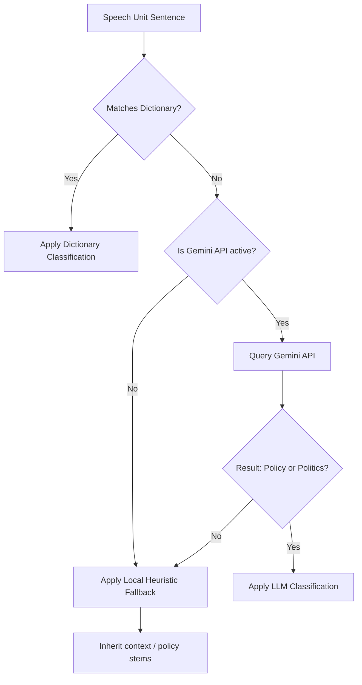

# Codebook: Politics without Policy? Measuring Agenda Shift and Executive Evasion in the Spanish Congress of Deputies (2019-2026)

This codebook describes the variables, classification criteria, dictionary lists, and Large Language Model (LLM) prompt parameters used to code the debate segments of Spain's weekly control sessions (*Preguntas Orales en Pleno*).

---

## 1. Unit of Analysis

The primary unit of analysis is the **Speech Unit (UD)**, which corresponds to a single sentence or a structurally independent clause spoken during a live Q&A debate. A Q&A exchange typically consists of four turns:
1.  **MP Turn 1**: Formulates the question.
2.  **Minister Turn 1**: Initial response.
3.  **MP Turn 2**: Replica.
4.  **Minister Turn 2**: Duplica (final turn).

---

## 2. Variables and Operationalization

The replication dataset (`data/processed/classified_dataset.csv`) contains the following variables for each Q&A debate $i$:

| Variable Name | Data Type | Description |
| :--- | :--- | :--- |
| `id` | String | Unique identifier of the initiative (e.g., `180/001290`). |
| `legislature` | Integer | Legislature number (either `14` or `15`). |
| `question` | String | Substantive title/manifest text of the registered oral question. |
| `author` | String | Name of the Member of Parliament (MP) asking the question. |
| `group` | String | Parliamentary group of the initiating MP. |
| `status` | String | Status of the initiative (e.g., *Contestada*). |
| `presentado_date` | Date | Submission date of the initiative. |
| `pub_id` | String | Official journal publication ID. |
| `manifest_topic` | Categorical | Manifest topic of the question: `policy` or `politics`. |
| `ASR` | Float | **Agenda Shift Rate**: Percentage of total debate turns coded as `politics` (calculated only for questions registered with a manifest topic of `policy`). |
| `ER` | Float | **Evasion Rate**: Percentage of the minister's response turns coded as `politics` (calculated only for questions registered with a manifest topic of `policy`). |
| `total_policy_ud` | Integer | Total count of speech units classified as `policy` across the debate. |
| `total_politics_ud`| Integer | Total count of speech units classified as `politics` across the debate. |
| `deputy_policy_ud` | Integer | Count of `policy` speech units spoken by the initiating MP. |
| `deputy_politics_ud`| Integer | Count of `politics` speech units spoken by the initiating MP. |
| `minister_policy_ud`| Integer | Count of `policy` speech units spoken by the government minister. |
| `minister_politics_ud`| Integer | Count of `politics` speech units spoken by the government minister. |
| `url` | String | URL to the official initiative metadata sheet on Congreso.es. |
| `transcript` | String | Raw text of the full Q&A debate transcript. |

---

## 3. Classification Schema and Coding Rules

Each speech unit is classified into one of two mutually exclusive categories:

### Category A: Policy (Gestión y Resultados)
Content focuses on the technical substance of public policy, legislative drafting, budgetary allocation, and public service management.
*   **Sub-topics Included**:
    *   *Housing & Urbanism*: Rent prices, mortgage rates, social housing (VPO), land regulations.
    *   *Energy & Environment*: Solar/wind/nuclear power, electricity bills, water management, drought measures.
    *   *Transport & Infrastructure*: Trains, roads, airport management, public transit (Cercanías/Rodalies).
    *   *Education & Health*: School curricula, university funding, healthcare lists, medical equipment, vaccines.
    *   *Economy & Employment*: Inflation (IPC), salary regulations (SMI), unemployment benefits, pension calculations.
    *   *Industry & Digitalization*: EU funds (PERTE), microchips, data centers, SME support.

### Category B: Politics (Partisan Tactics and Legitimacy)
Content focuses on party competition, electoral strategies, territorial conflicts, moral corruption accusations, or the legitimacy of executive coalitions.
*   **Sub-topics Included**:
    *   *Territorial Pacts*: Amnesties, independence agreements, sovereignty, regional coalitions (ERC, Bildu, Junts).
    *   *Judicial Organs*: CGPJ blocking, Supreme Court appointments, constitutional complaints.
    *   *Corruption Allegations*: Scandals (Caso Koldo, Begoña Gómez), embezzlement, masks procurement, financial fraud.
    *   *Media Conflicts*: Accusations of spreading fake news, media censorship, political bias.
    *   *Partisan Ad-Hominem*: Attacks on party leaders (Sánchez, Feijóo, Abascal) or referencing historical terrorism (ETA).

---

## 4. The Hybrid Classification Algorithm

Classification is executed sequentially for each speech unit to ensure speed and replicability:



### A. Dictionary Keywords (Regex Patterns)
*   **Policy Patterns**: `vivienda\w*`, `alquiler\w*`, `hipoteca\w*`, `desahuc\w*`, `energía\w*`, `electric\w*`, `tren\w*`, `cercanía\w*`, `sanidad\w*`, `salud\b`, `inflación\w*`, `empleo\w*`, `paro\b`, `pyme\w*`, etc.
*   **Politics Patterns**: `amnistía\w*`, `pacto\w*`, `investidura\w*`, `independencia\w*`, `cgpj\b`, `juez\w*`, `corrupción\w*`, `caso \w+`, `trama\w*`, `fango\b`, `bulo\w*`, `sánchez\w*`, `feijóo\w*`, `abascal\w*`, `eta\b`, etc.

### B. LLM Zero-Shot Classification Prompt
When a speech unit is marked as ambiguous (matching both or neither dictionary category), the script queries the Gemini API with the following prompt:

```text
Clasifica la siguiente oración de un debate parlamentario español como 'policy' (gestión, políticas públicas, datos, plazos) o 'politics' (confrontación partidista, amnistía, corrupción, alianzas de poder).
Responde únicamente con una palabra: 'policy' o 'politics'.

Oración: "{sentence}"
Respuesta:
```

### C. Local Heuristic Fallback (Offline Mode)
If no Gemini API Key is provided, ambiguous sentences are evaluated for basic policy keywords (e.g. *euros, ley, proyecto, inversión*) to classify them as `policy`. If none are found, they default to `politics` as the baseline.
